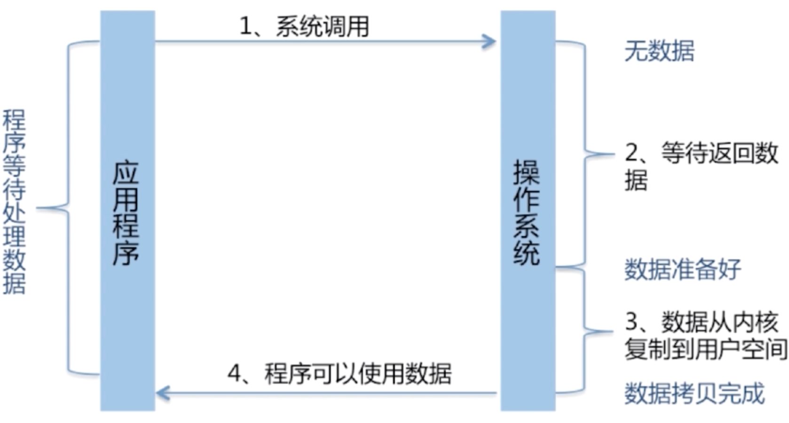
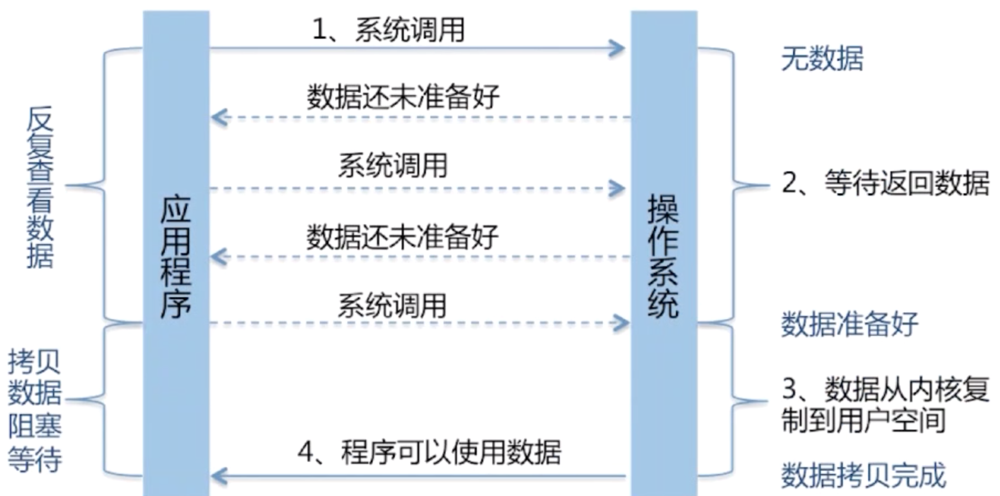
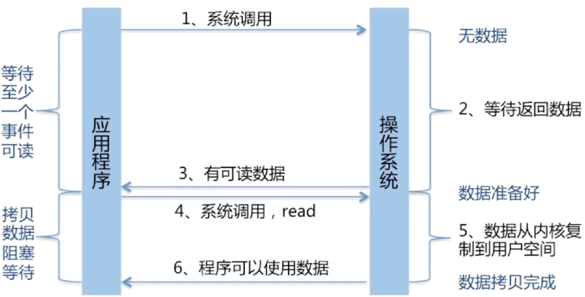
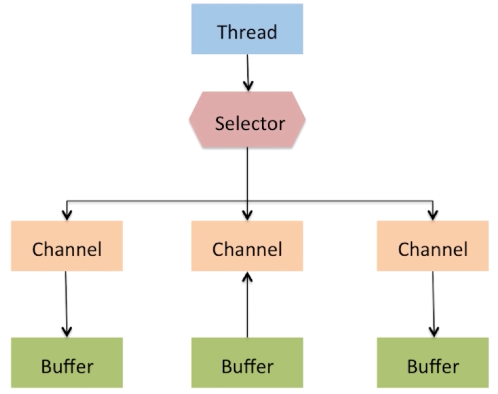
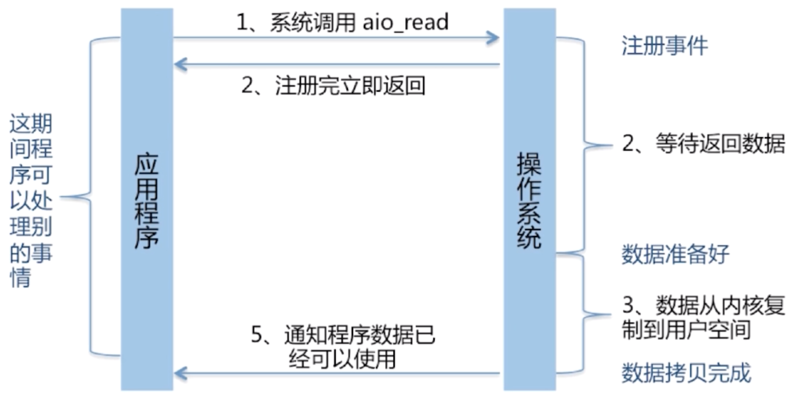

## BIO
Block-IO：InputStream和OutputStream，Reader和Writer。属于同步阻塞模型

同步阻塞：一个请求占用一个进程处理，先等待数据准备好，然后从内核向进程复制数据，最后处理完数据后返回

## NIO
NonBlock-IO：Channel、Buffer、Selector。属于IO多路复用的同步非阻塞模型

同步非阻塞：进程先将一个套接字在内核中设置成非阻塞再等待数据准备好，在这个过程中反复轮询内核数据是否准备好，准备好之后最后处理数据返回

IO多路复用：同步非阻塞的优化版本，区别在于IO多路复用阻塞在select，epoll这样的系统调用之上，而没有阻塞在真正的IO系统调用上。换句话说，轮询机制被优化成通知机制，多个连接公用一个阻塞对象，进程只需要在一个阻塞对象上等待，无需再轮询所有连接

在Java的NIO中，是基于Channel和Buffer进行操作，数据总是从通道读取到缓冲区中，或者从缓冲区写入到通道中。Selector用于监听多个通道的事件（比如：连接打开，数据到达）

因此，单个线程可以监听多个数据通道，Selector的底层实现是epoll/poll/select的IO多路复用模型，select方法会一直阻塞，直到channel中有事件就绪：

与BIO区别如下：

1. 通过缓冲区而非流的方式进行数据的交互，流是进行直接的传输的没有对数据操作的余地，缓冲区提供了灵活的数据处理方式
2. NIO是非阻塞的，意味着每个socket连接可以让底层操作系统帮我们完成而不需要每次开个线程去保持连接，使用的是selector监听所有channel的状态实现
3. NIO提供直接内存复制方式，消除了JVM与操作系统之间读写内存的损耗

## AIO
Asynchronous IO：属于事件和回调机制的异步非阻塞模型

AIO得到结果的方式：

* 基于回调：实现CompletionHandler接口，调用时触发回调函数
* 返回Future：通过isDone()查看是否准备好，通过get()等待返回数据

但要实现真正的异步非阻塞IO，需要操作系统支持，Windows支持而Linux不完善