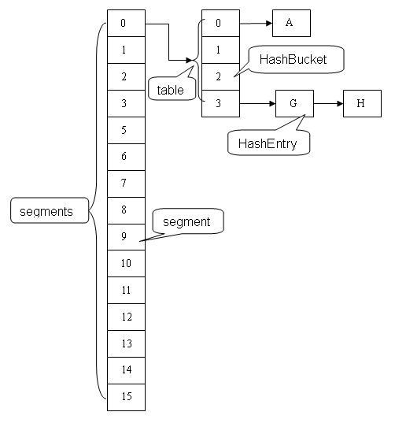
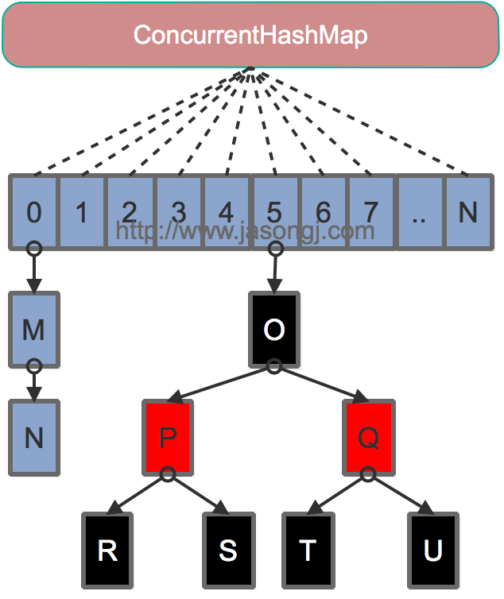

## 集合
### ArrayList与LinkedList区别

|ArrayList|LinkedList|
|--------|--------|
|数组|双向链表|
|增删的时候在扩容的时候慢，通过索引查询快，通过对象查索引慢|增删快，通过索引查询慢，通过对象查索引慢|
|当数组无法容纳下此次添加的元素时进行扩容|无|
|扩容之后容量为原来的1.5倍|无|

### HashMap
1. JDK 1.8 以前 HashMap 的实现是 数组+单链表，即使哈希函数取得再好，也很难达到元素百分百均匀分布。当 HashMap 中有大量的元素都存放到同一个桶中时，这个桶下有一条长长的链表，这个时候 HashMap 就相当于一个单链表，假如单链表有 n 个元素，遍历的时间复杂度就是 O(n)，完全失去了它的优势。针对这种情况，JDK 1.8 中引入了红黑树（查找时间复杂度为 O(logn)）来优化这个问题
2. 为什么线程不安全？多线程PUT操作时可能会覆盖刚PUT进去的值；扩容操作会让链表形成环形数据结构，形成死循环
3. 容量的默认大小是 16，负载因子是 0.75，当 HashMap 的 size > 16*0.75 时就会发生扩容(容量和负载因子都可以自由调整)。
4. 为什么容量是2的倍数？在根据hashcode查找数组中元素时，取模性能远远低于与性能，且和2^n-1进行与操作能保证各种不同的hashcode对应的元素也能均匀分布在数组中

### HashMap rehash过程：
1. 空间不够用了，所以需要分配一个大一点的空间，然后保存在里面的内容需要重新计算 hash
2. 如果两个线程都发现HashMap需要重新调整大小了，它们会同时试着调整大小
3. 在调整大小的过程中，存储在链表中的元素的次序会反过来，因为移动到新的bucket位置的时候，HashMap并不会将元素放在链表的尾部，而是放在头部，这是为了避免尾部遍历(tail traversing)。如果条件竞争发生了，那么就死循环了

### ConcurrentHashMap原理
[http://www.jasongj.com/java/concurrenthashmap/](http://www.jasongj.com/java/concurrenthashmap/)

HashTable 在每次同步执行时都要锁住整个结构。ConcurrentHashMap 锁的方式是稍微细粒度的。 ConcurrentHashMap 将 hash 表分为 16 个桶（默认值）  
最大并发个数就是Segment的个数，默认值是16，可以通过构造函数改变一经创建不可更改，这个值就是并发的粒度，每一个segment下面管理一个table数组，加锁的时候其实锁住的是整个segment
#### Java7

ConcurrentHashMap 类中包含两个静态内部类 HashEntry 和 Segment。HashEntry 用来封装映射表的键 / 值对；Segment 用来充当锁的角色，每个 Segment 对象守护整个散列映射表的若干个桶。每个桶是由若干个 HashEntry 对象链接起来的链表。一个 ConcurrentHashMap 实例中包含由若干个 Segment 对象组成的数组。

#### Java8

1. 为进一步提高并发性，放弃了分段锁，锁的级别控制在了更细粒度的table元素级别，也就是说只需要锁住这个链表的head节点，并不会影响其他的table元素的读写，好处在于并发的粒度更细，影响更小，从而并发效率更好
2. 使用CAS + synchronized 来保证实现put操作：如果Key对应的数组元素为null，则通过CAS操作将其设置为当前值。如果Key对应的数组元素（也即链表表头或者树的根元素）不为null，则对该元素使用synchronized关键字申请锁，然后进行操作。如果该put操作使得当前链表长度超过一定阈值，则将链表（寻址时间复杂度为O(N)）转换为红黑树（寻址时间复杂度为O(log(N))，插入操作完成之后如果所有元素的数量大于当前容量（默认16）*负载因子（默认0.75）就进行扩容。
  

欢迎光临[我的博客](http://www.wangtianyi.top/?utm_source=github&utm_medium=github)，发现更多技术资源~
