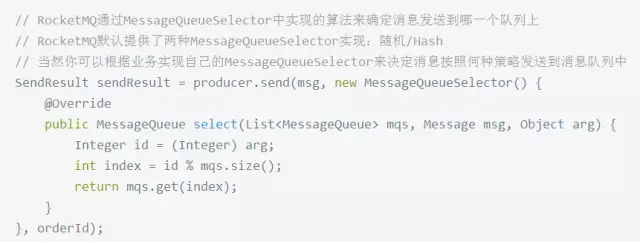

## 优点
1. 减少请求响应时间。比如注册功能需要调用第三方接口来发短信，如果等待第三方响应可能会需要很多时间
2. 服务之间解耦。主服务只关心核心的流程，其他不重要的、耗费时间流程是否如何处理完成不需要知道，只通知即可
3. 流量削锋。对于不需要实时处理的请求来说，当并发量特别大的时候，可以先在消息队列中作缓存，然后陆续发送给对应的服务去处理

## 缺点
1. 系统可用性降低。系统引入的外部依赖越多，越容易挂掉。
2. 系统复杂度提高。保证消息没有重复消费？处理消息丢失的情况？保证消息传递的顺序性？

## 消息重复消费问题
1. 消费端处理消息的业务逻辑保持幂等性，在消费端实现
2. 利用一张日志表来记录已经处理成功的消息的ID，如果新到的消息ID已经在日志表中，那么就不再处理这条消息。消息系统实现，也可以消费端实现

## 消息丢失问题
### 生产者弄丢了数据
生产者将数据发送到 RabbitMQ 的时候，可能数据就在半路给搞丢了。

RabbitMQ 提供的事务功能，就是生产者发送数据之前开启 RabbitMQ 事务。然后发送消息，如果消息没有成功被 RabbitMQ 接收到，那么生产者会收到异常报错。但吞吐量会下来，因为太耗性能。

可以开启confirm模式，你每次写的消息都会分配一个唯一的 id，然后如果写入了 RabbitMQ 中，RabbitMQ 会给你回传一个ack消息，告诉你说这个消息 ok 了。事务机制是同步的，但confirm机制是异步的，发送个消息之后就可以发送下一个消息，RabbitMQ 接收了之后会异步回调你一个接口通知你这个消息接收到了。所以用confirm机制

### RabbitMQ 弄丢了数据
RabbitMQ 自己挂掉导致数据丢失

开启 RabbitMQ 的持久化，消息写入之后会持久化到磁盘，哪怕是 RabbitMQ 自己挂了，恢复之后会自动读取之前存储的数据

### 消费端弄丢了数据
RabbitMQ 如果丢失了数据，主要是因为你消费的时候，刚消费到，还没处理，结果进程挂了，比如重启了，RabbitMQ 认为你都消费了，这数据就丢了。

关闭 RabbitMQ 的自动ack，可以通过一个 api 来调用就行，然后每次你自己代码里确保处理完的时候，再在程序里ack一把。RabbitMQ 就认为你还没处理完，这个时候 RabbitMQ 会把这个消费分配给别的 consumer 去处理，消息是不会丢的。

## 消息顺序性
消息有序指的是可以按照消息的发送顺序来消费。例如：一笔订单产生了 3 条消息，分别是订单创建、订单付款、订单完成。消费时，要按照顺序依次消费才有意义。

消息体通过hash分派到队列里，每个队列对应唯一一个消费者。比如下面的示例中，订单号相同的消息会被先后发送到同一个队列中：

在获取到路由信息以后，会根据MessageQueueSelector实现的算法来选择一个队列，同一个订单号获取到的肯定是同一个队列。

## 集群模式
### 普通集群模式
在多台机器上启动多个 RabbitMQ 实例。你创建的 queue，只会放在一个 RabbitMQ 实例上，但是每个实例都同步 queue 的元数据（元数据可以认为是 queue 的一些配置信息，通过元数据，可以找到 queue 所在实例）。你消费的时候，实际上如果连接到了另外一个实例，那么那个实例会从 queue 所在实例上拉取数据过来。

缺点是不能保证高可用、还有拉去数据的开销、以及单实例的性能瓶颈，所以这个方案是为了提高吞吐量的

### 镜像集群模式
每个 RabbitMQ 节点都有这个 queue 的一个完整镜像，包含 queue 的全部数据的意思。然后每次你写消息到 queue 的时候，都会自动把消息同步到多个实例的 queue 上。任何一个机器宕机了，没事儿，其它机器（节点）还包含了这个 queue 的完整数据，别的 consumer 都可以到其它节点上去消费数据。

缺点是即时满足了高可用，但因为同步数据量太重导致难以扩展节点，也没有在架构上实现负载均衡，可以参考Redis的集群模式进行优化。

### Kafka 的高可用性
Kafka 一个最基本的架构认识：由多个 broker 组成，每个 broker 是一个节点；你创建一个 topic，这个 topic 可以划分为多个 partition，每个 partition 可以存在于不同的 broker 上，每个 partition 就放一部分数据

每个 partition 的数据都会同步到其它机器上，形成自己的多个 replica 副本。所有 replica 会选举一个 leader 出来，那么生产和消费都跟这个 leader 打交道，然后其他 replica 就是 follower。写的时候，leader 会负责把数据同步到所有 follower 上去，读的时候就直接读 leader 上的数据即可。

如果某个 broker 宕机了，没事儿，那个 broker上面的 partition 在其他机器上都有副本的，如果这上面有某个 partition 的 leader，那么此时会从 follower 中重新选举一个新的 leader 出来，大家继续读写那个新的 leader 即可。这就有所谓的高可用性了。

https://github.com/doocs/advanced-java#%E6%B6%88%E6%81%AF%E9%98%9F%E5%88%97 https://dbaplus.cn/news-73-1123-1.html

欢迎光临[我的博客](http://www.wangtianyi.top/?utm_source=github&utm_medium=github)，发现更多技术资源~
