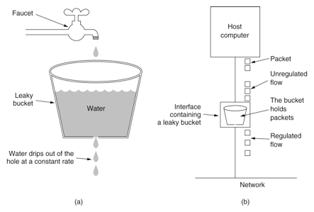
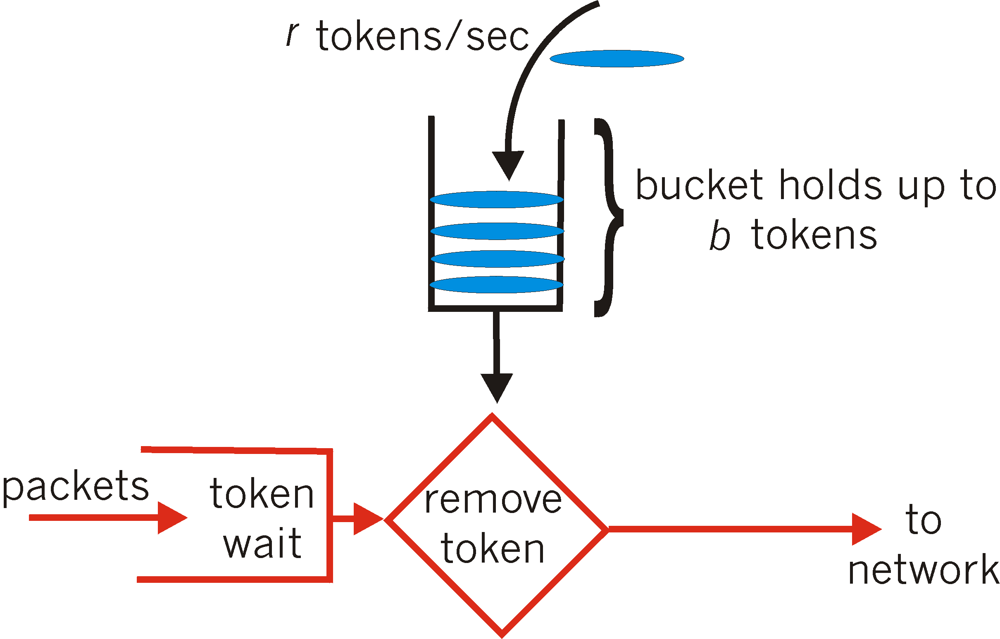

# 常见算法
对于限流常见有两种算法:

1. 漏桶算法
2. 令牌桶算法

漏桶算法比较简单，就是将流量放入桶中，漏桶同时也按照一定的速率流出，如果流量过快的话就会溢出(漏桶并不会提高流出速率)。溢出的流量则直接丢弃。

如下图所示:



漏桶算法虽说简单，但却不能应对实际场景，比如突然暴增的流量。

这时就需要用到令牌桶算法:令牌桶会以一个恒定的速率向固定容量大小桶中放入令牌，当有流量来时则取走一个或多个令牌。当桶中没有令牌则将当前请求丢弃或阻塞。



相比之下令牌桶可以应对一定的突发流量.

# RateLimiter实现

对于令牌桶的代码实现，可以直接使用Guava包中的RateLimiter。

```java
@Override
public BaseResponse<UserResVO> getUserByFeignBatch(@RequestBody UserReqVO userReqVO) {
    //调用远程服务
    OrderNoReqVO vo = new OrderNoReqVO() ;
    vo.setReqNo(userReqVO.getReqNo());

    RateLimiter limiter = RateLimiter.create(2.0) ;
    //批量调用
    for (int i = 0 ;i< 10 ; i++){
        double acquire = limiter.acquire();
        logger.debug("获取令牌成功!,消耗=" + acquire);
        BaseResponse<OrderNoResVO> orderNo = orderServiceClient.getOrderNo(vo);
        logger.debug("远程返回:"+JSON.toJSONString(orderNo));
    }

    UserRes userRes = new UserRes() ;
    userRes.setUserId(123);
    userRes.setUserName("张三");

    userRes.setReqNo(userReqVO.getReqNo());
    userRes.setCode(StatusEnum.SUCCESS.getCode());
    userRes.setMessage("成功");

    return userRes ;
}
```

代码可以看出以每秒向桶中放入两个令牌，请求一次消耗一个令牌。所以每秒钟只能发送两个请求。按照图中的时间来看也确实如此(返回值是获取此令牌所消耗的时间，差不多也是每500ms一个)。

使用RateLimiter 有几个值得注意的地方:

允许先消费，后付款，意思就是它可以来一个请求的时候一次性取走几个或者是剩下所有的令牌甚至多取，但是后面的请求就得为上一次请求买单，它需要等待桶中的令牌补齐之后才能继续获取令牌。


# 其他算法
1. 固定窗口算法又叫计数器算法，是一种简单方便的限流算法。主要通过一个支持原子操作的计数器来累计 1 秒内的请求次数，当 1 秒内计数达到限流阈值时触发拒绝策略。每过 1 秒，计数器重置为 0 开始重新计数。虽然我们限制了 QPS 为 2，但是当遇到时间窗口的临界突变时，如 1s 中的后 500 ms 和第 2s 的前 500ms 时，虽然是加起来是 1s 时间，却可以被请求 4 次。
2. 滑动窗口算法在固定窗口的基础上，将一个计时窗口分成了若干个小窗口，然后每个小窗口维护一个独立的计数器。当请求的时间大于当前窗口的最大时间时，则将计时窗口向前平移一个小窗口。平移时，将第一个小窗口的数据丢弃，然后将第二个小窗口设置为第一个小窗口，同时在最后面新增一个小窗口，将新的请求放在新增的小窗口中。同时要保证整个窗口中所有小窗口的请求数目之后不能超过设定的阈值。有效解决了窗口切换时可能会产生两倍于阈值流量请求的问题。

https://p3-juejin.byteimg.com/tos-cn-i-k3u1fbpfcp/4b39534226cf4981a4c4632f0cab335e~tplv-k3u1fbpfcp-zoom-in-crop-mark:1512:0:0:0.awebp)


