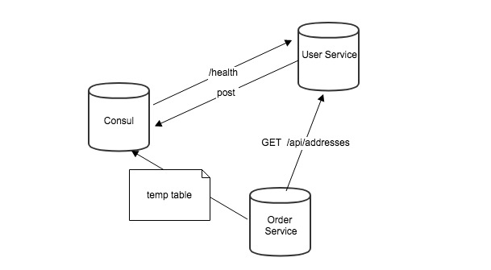

## 定义
在微服务应用中，运行的服务实例集会动态更改。实例能动态分配网络位置。所以为了使客户端向服务端发送请求它必须使用服务发现机制。

客户端应用进程向注册中心发起查询，来获取服务的位置。服务发现的一个重要作用就是提供一个可用的服务列表。

## 原理

1. 当User Service启动的时候，会向Consul发送一个POST请求，告诉Consul自己的IP和Port
2. Consul 接收到User Service的注册后，每隔10s（默认）会向User Service发送一个健康检查的请求，检验User Service是否健康（Consul其实支持其他健康检查机制）
3. 当Order Service发送 GET 方式请求/api/addresses到User Service时，会先从Consul中拿到一个存储服务 IP 和 Port 的临时表，从表中拿到User Service的IP和Port后再发送GET方式请求/api/addresses
4. 该临时表每隔10s会更新，只包含有通过了健康检查的Service

上面注册、查询的逻辑不是Consul提供的，一般是你使用的微服务框架中已经封装好的服务注册发现功能，如果没有特殊的需求是不会修改这部分逻辑的

https://sjyuan.cc/service-registration-and-discovery/

欢迎光临[我的博客](http://www.wangtianyi.top/?utm_source=github&utm_medium=github)，发现更多技术资源~
