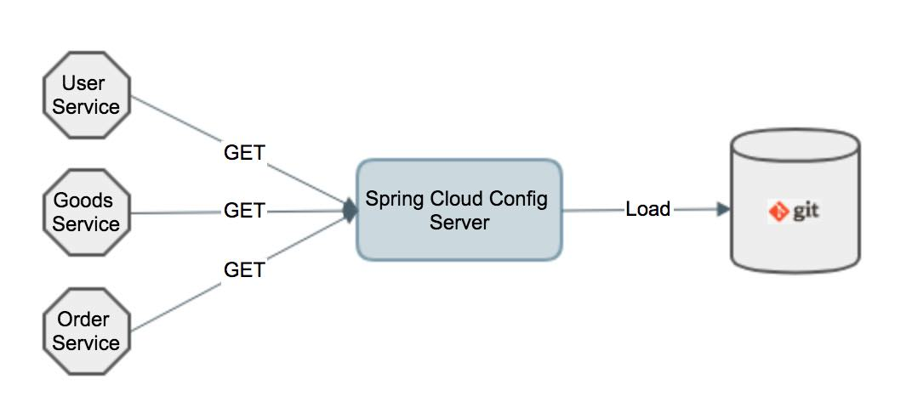

我们的每个服务的配置文件都是在自身代码库中，当服务数量达到一定数量后，管理这些分散的配置文件会成为一个痛点。这节课我么就来解决配置文件管理的痛点

Spring Cloud Config的目标是将各个微服务的配置文件集中存储一个文件仓库中（比如系统目录，Git仓库等等），然后通过Config Server从文件仓库中去读取配置文件，而各个微服务作为Config Client通过给Config Server发送请求指令来获取特定的Profile的配置文件，从而为自身的应用提供配置信息。同时还提供配置文件自动刷新功能。

https://sjyuan.cc/service-config-server/

欢迎光临[我的博客](http://www.wangtianyi.top/?utm_source=github&utm_medium=github)，发现更多技术资源~
