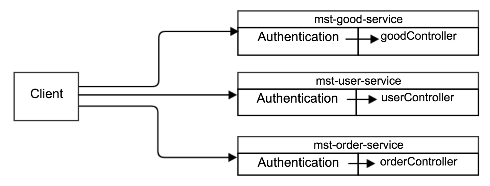
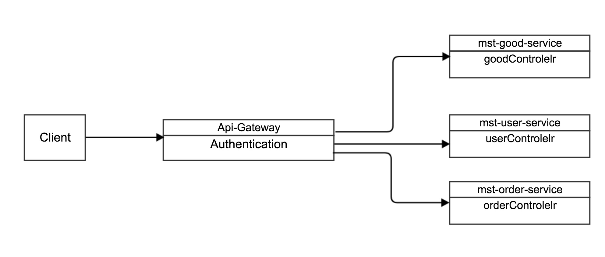
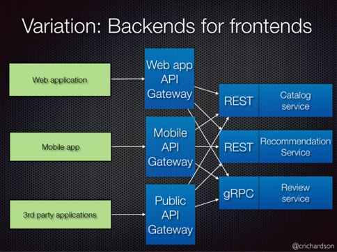

## 定义
API网关。它是系统的单个入口服务器。它类似于面向对象的外观模式。它封装了内部系统架构并且提供了每个客户端定制的API。它可能还有其他的职责比如身份验证、监控、负载均衡、缓存、请求整理和管理还有静态相应处理。

## 优点
### 流量统一管理、路由
它用于解决微服务过于分散，没有一个统一的出入口进行流量管理、路由映射、监控、缓存、负载均衡的问题。 我们用两张图来解释：

如上图所示的mst-user-service, mst-good-service, mst-order-service，这些应用会需要一些通用的功能，比如Authentication, 这些功能过于分散，代码就需要在三个服务中都写一遍，因此需要有一个统一的出入口来管理流量，就像下图

### 设备适配
 还可以针对不同的渠道和客户端提供不同的API Gateway,对于该模式的使用由另外一个大家熟知的方式叫Backend for front-end, 在Backend for front-end模式当中，我们可以针对不同的客户端分别创建其BFF。

### 协议转换
客户端直接调用微服务可能会使用对网络不友好的协议。内部服务之间可能使用Thrift二进制RPC、gRPC协议。两个协议对浏览器不友好并且最好是在内部使用。应用应该在防火墙之外使用HTTP或者WebSocket之类的协议。

## 缺点
API网关是一个必须被开发、部署、管理的高可用组件。还有一个风险是它变成开发瓶颈。开发人员必须更新API网关来暴露每个微服务接口。因此更新API网关的过程越少越好。然而，对于大多数现实世界的应用，使用API网关是有意义的。

欢迎光临[我的博客](http://www.wangtianyi.top/?utm_source=github&utm_medium=github)，发现更多技术资源~
