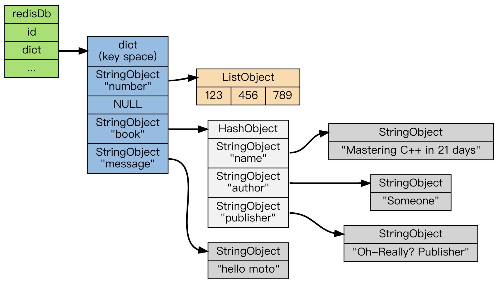
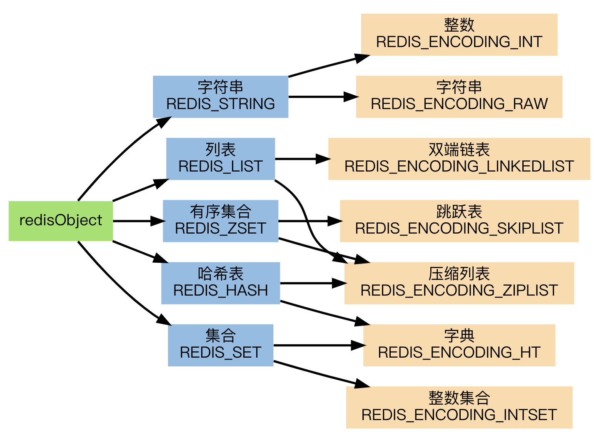
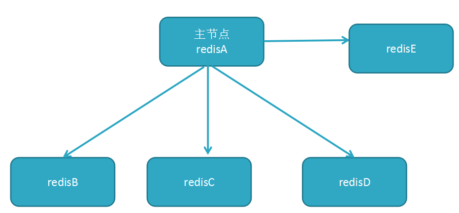
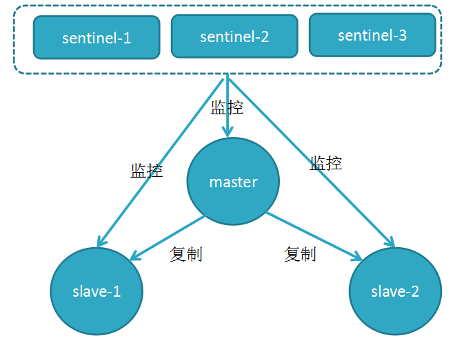

## 数据类型
来源：https://redisbook.readthedocs.io/en/latest/internal/db.html#id4

Redis是一个键值对数据库，数据库中的键值对由字典保存。每个数据库都有一个对应的字典，这个字典被称之为键空间。当用户添加一个键值对到数据库时（不论键值对是什么类型）， 程序就将该键值对添加到键空间

字典的键是一个字符串对象。字典的值则可以是包括【字符串、列表、哈希表、集合或有序集】在内的任意一种 Redis 类型对象。

上图展示了一个包含 number 、 book 、 message 三个键的数据库 —— 其中 number 键是一个列表，列表中包含三个整数值； book 键是一个哈希表，表中包含三个键值对； 而 message 键则指向另一个字符串：

不同的数据类型的具体实现（压缩列表、跳表必看）请看： https://redisbook.readthedocs.io/en/latest/index.html#id3

在线文档：http://118.25.23.115/

压缩链表原理：
在内存中是连续存储的，但是不同于数组，为了节省内存，ziplist的每个元素所占的内存大小可以不同
ziplist将一些必要的偏移量信息记录在了每一个节点里，使之能跳到上一个节点或下一个节点

与跳表应用场景：
当zset满足以下两个条件的时候，使用ziplist：
1. 保存的元素少于128个
2. 保存的所有元素大小都小于64字节

redis数据过期策略：
定时过期：每个设置过期时间的key都需要创建一个定时器，到过期时间就会立即清除
惰性过期：只有当访问一个key时，才会判断该key是否已过期，过期则清除
定期过期：每隔一定的时间，会扫描一定数量的数据库的expires字典中一定数量的key，并清除其中已过期的key

内存淘汰策略：
no-eviction：当内存不足以容纳新写入数据时，新写入操作会报错
allkeys-lru：当内存不足以容纳新写入数据时，在键空间中，移除最近最少使用的key
allkeys-random：当内存不足以容纳新写入数据时，在键空间中，随机移除某个key
volatile-lru：当内存不足以容纳新写入数据时，在设置了过期时间的键空间中，移除最近最少使用的key
volatile-random：当内存不足以容纳新写入数据时，在设置了过期时间的键空间中，随机移除某个key
volatile-ttl：当内存不足以容纳新写入数据时，在设置了过期时间的键空间中，有更早过期时间的key优先移除

Redis 是单线程吗？
1. Redis 单线程指的是「接收客户端请求->解析请求 ->进行数据读写等操作->发生数据给客户端」这个过程是由一个线程（主线程）来完成的但是，Redis 程序并不是单线程的，Redis 在启动的时候，是会启动后台线程（BIO）的：
2. Redis 在 2.6 版本，会启动 2 个后台线程，分别处理关闭文件、AOF 刷盘这两个任务；
3. Redis 在 4.0 版本之后，新增了一个新的后台线程，用来异步释放 Redis 内存，也就是 lazyfree 线程。例如执行 unlink key / flushdb async / flushall async 等命令，会把这些删除操作交给后台线程来执行，好处是不会导致 Redis 主线程卡顿。因此，当我们要删除一个大 key 的时候，不要使用 del 命令删除，因为 del 是在主线程处理的，这样会导致 Redis 主线程卡顿，因此我们应该使用 unlink 命令来异步删除大key。

Redis 采用单线程为什么还这么快？
1. Redis 的大部分操作都在内存中完成，并且采用了高效的数据结构
2. Redis 采用单线程模型可以避免了多线程之间的竞争，省去了多线程切换带来的时间和性能上的开销，而且也不会导致死锁问题
3. Redis 采用了I/O 多路复用机制处理大量的客户端 Socket 请求，IO 多路复用机制是指一个线程处理多个 IO 流，就是我们经常听到的 select/epoll 机制。简单来说，在 Redis 只运行单线程的情况下，该机制允许内核中，同时存在多个监听 Socket 和已连接 Socket。内核会一直监听这些 Socket 上的连接请求或数据请求。一旦有请求到达，就会交给 Redis 线程处理，这就实现了一个 Redis 线程处理多个 IO 流的效果。

Redis 6.0 之后为什么引入了多线程？
1. 随着网络硬件的性能提升，Redis 的性能瓶颈有时会出现在网络 I/O 的处理上。所以为了提高网络请求处理的并行度
2. 对于读写命令，Redis 仍然使用单线程来处理，Redis 官方表示，Redis 6.0 版本引入的多线程 I/O 特性对性能提升至少是一倍以上。

## 集群模式
来源：  
https://my.oschina.net/zhangxufeng/blog/905611  
https://www.cnblogs.com/leeSmall/p/8398401.html  
https://docs.aws.amazon.com/zh_cn/AmazonElastiCache/latest/red-ug/CacheNodes.NodeGroups.html  

### 主从

用一个redis实例作为主机，其余的实例作为从机。主机和从机的数据完全一致，主机支持数据的写入和读取等各项操作，而从机则只支持与主机数据的同步和读取。因而可以将写入数据的命令发送给主机执行，而读取数据的命令发送给不同的从机执行，从而达到读写分离的目的。

问题是主从模式如果所连接的redis实例因为故障下线了，没有提供一定的手段通知客户端另外可连接的客户端地址，因而需要手动更改客户端配置重新连接。如果主节点由于故障下线了，那么从节点因为没有主节点而同步中断，因而需要人工进行故障转移工作。为了解决这两个问题，在2.8版本之后redis正式提供了sentinel（哨兵）架构。
### 哨兵

由Sentinel节点定期监控发现主节点是否出现了故障，当主节点出现故障时，由Redis Sentinel自动完成故障发现和转移，并通知应用方，实现高可用性。

### 集群

redis主从或哨兵模式的每个实例都是全量存储所有数据，浪费内存且有木桶效应。为了最大化利用内存，可以采用集群，就是分布式存储。集群将数据分片存储，每组节点存储一部分数据，从而达到分布式集群的目的。

上图是主从模式与集群模式的区别，redis集群中数据是和槽（slot）挂钩的，其总共定义了16384个槽，所有的数据根据一致哈希算法会被映射到这16384个槽中的某个槽中；另一方面，这16384个槽是按照设置被分配到不同的redis节点上。

但集群模式会直接导致访问数据方式的改变，比如客户端向A节点发送GET命令但该数据在B节点，redis会返回重定向错误给客户端让客户端再次发送请求，这也直接导致了必须在相同节点才能执行的一些高级功能（如Lua、事务、Pipeline）无法使用。另外还会引发数据分配的一致性hash问题可以参看[这里](https://github.com/crossoverJie/JCSprout/blob/master/MD/Consistent-Hash.md)

### 如何选择

1. 集群的优势在于高可用，将写操作分开到不同的节点，如果写的操作较多且数据量巨大，且不需要高级功能则可能考虑集群
2. 哨兵的优势在于高可用，支持高级功能，且能在读的操作较多的场景下工作，所以在绝大多数场景中是适合的
3. 主从的优势在于支持高级功能，且能在读的操作较多的场景下工作，但无法保证高可用，不建议在数据要求严格的场景下使用

## 使用策略
### 延迟加载
读：当读请求到来时，先从缓存读，如果读不到就从数据库读，读完之后同步到缓存且添加过期时间  
写：当写请求到来时，只写数据库  

优点：仅对请求的数据进行一段时间的缓存，没有请求过的数据就不会被缓存，节省缓存空间；节点出现故障并不是致命的，因为可以从数据库中得到  
缺点：缓存数据不是最新的；【缓存击穿】；【缓存失效】  

### 直写
读：当读请求到来时，先从缓存读，如果读不到就从数据库读，读完之后同步到缓存且设置为永不过期   
写：当写请求到来时，先写数据库然后同步到缓存，设置为永不过期  

优点：缓存数据是最新的，无需担心缓存击穿、失效问题，编码方便  
缺点：大量数据可能没有被读取的资源浪费；节点故障或重启会导致缓存数据的丢失直到有写操作同步到缓存；每次写入都需要写缓存导致的性能损失  

永不过期的缓存会大量占用空间，可以设置过期时间来改进，但是会引进【缓存失效】问题，需要注意解决  

### 如何选择
如果需要缓存与数据库数据保持实时一致，则需要选择直写方式  
如果缓存服务很稳定、缓存的可用空间大、写缓存的性能丢失能够接受，选择直写方式比较方便实现  
否则选择延迟加载，同时注意解决引进的问题  

## 缓存问题
### 缓存击穿
查询一个数据库中不存在的数据，比如商品详情，查询一个不存在的ID，每次都会访问DB，如果有人恶意破坏，很可能直接对DB造成过大地压力。

当通过某一个key去查询数据的时候，如果对应在数据库中的数据都不存在，我们将此key对应的value设置为一个默认的值。
### 缓存失效
在高并发的环境下，如果此时key对应的缓存失效，此时有多个进程就会去同时去查询DB，然后再去同时设置缓存。这个时候如果这个key是系统中的热点key或者同时失效的数量比较多时，DB访问量会瞬间增大，造成过大的压力。

将系统中key的缓存失效时间均匀地错开　　
### 热点key
缓存中的某些Key(可能对应用与某个促销商品)对应的value存储在集群中一台机器，使得所有流量涌向同一机器，成为系统的瓶颈，该问题的挑战在于它无法通过增加机器容量来解决。

1. 客户端热点key缓存：将热点key对应value并缓存在客户端本地，并且设置一个失效时间。
2. 将热点key分散为多个子key，然后存储到缓存集群的不同机器上，这些子key对应的value都和热点key是一样的。

## 持久化
RDB 持久化可以在指定的时间间隔内生成数据集的时间点快照（point-in-time snapshot）。  
1. save:save 是需要占用主线程资源的，会阻塞主线程。
2. bgsave:使用的是子进程写，不会占用主线程的资源（fork会阻塞主线程，但是copyonwrite过程是纳秒级别相对较快，aof是毫秒级别）。redis使用了操作系统的写时复制技术（COPY -ON-WRITE COW）bgsave子进程是由主进程fork生成的，可以共享主进程的内存，如果主进程有写入命令时候，主进程会把写入的那块内存页先复制一份给fork使用，这样就不影响主进程的写操作，可以继续修改原来的数据，避免了对正常业务的影响。

AOF 持久化记录服务器执行的所有写操作命令，aof日志的重写是由后台程序bgrewriteaof子进程完成的，这也是为了避免阻塞主线程，导致数据性能下降。Redis 还可以在后台对 AOF 文件进行重写（rewrite重写机制就是把这条键值对的多次操作压缩成一次操作，这样就大大减少了aof日志文件的大小。），使得 AOF 文件的体积不会超出保存数据集状态所需的实际大小。  
1. always 同步回写：每条命令执行完成后，回立即将日志写回磁盘。always回写回占用主线程资源，每次回写都是一个慢速的罗盘操作，基本上可以避免数据的丢失，会对主线程产生影响，如果你对redis数据的准确性要求非常高，而写入和读取占比不高的话，可以采用这种策略。
2. everysec 每秒回写：每个命令执行完后回先将日志写入aof文件的内存缓冲区，每隔一秒把缓冲区中的命令写入磁盘。每秒回写采用一秒回写一次的策略，避免了同步回写的性能开销，虽然减少了对系统性能的影响，但是如果1秒内产生了大量的写操作，在aof缓冲区积压了很多日志，这时候还没来得及写入aof日志文件就发生了宕机，就会造成数据的丢失。
3. no 操作系统控制的回写：每个写命令执行完后只是先把日志写入aof文件的内存缓冲区，何时回写磁盘由操作系统决定。采用操作系统控制的回写，在写完aof缓冲区后就可以继续执行命令，但是如果系统发生宕机了，也同样会造成数据的丢失。

Redis 还可以同时使用 AOF 持久化和 RDB 持久化。 在这种情况下， 当 Redis 重启时， 它会优先使用 AOF 文件来还原数据集， 因为 AOF 文件保存的数据集通常比 RDB 文件所保存的数据集更完整。  
## 渐进式rehash
以下是哈希表渐进式 rehash 的详细步骤：
1. 为 ht[1] 分配空间， 让字典同时持有 ht[0] 和 ht[1] 两个哈希表。
2. 在字典中维持一个索引计数器变量 rehashidx ， 并将它的值设置为 0 ， 表示 rehash 工作正式开始。
3. 在 rehash 进行期间， 每次对字典执行添加、删除、查找或者更新操作时， 程序除了执行指定的操作以外， 还会顺带将 ht[0] 哈希表在 rehashidx 索引上的所有键值对 rehash 到 ht[1] ， 当 rehash 工作完成之后， 程序将 rehashidx 属性的值增一。
4. 随着字典操作的不断执行， 最终在某个时间点上， ht[0] 的所有键值对都会被 rehash 至 ht[1] ， 这时程序将 rehashidx 属性的值设为 -1 ， 表示 rehash 操作已完成。
渐进式 rehash 的好处在于它采取分而治之的方式， 将 rehash 键值对所需的计算工作均滩到对字典的每个添加、删除、查找和更新操作上， 从而避免了集中式 rehash 而带来的庞大计算量。

欢迎光临[我的博客](http://www.wangtianyi.top/?utm_source=github&utm_medium=github)，发现更多技术资源~
