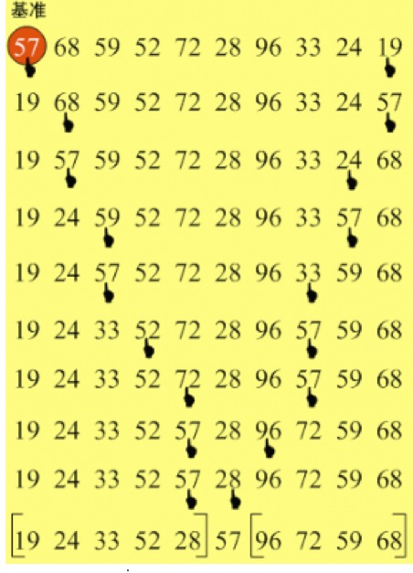
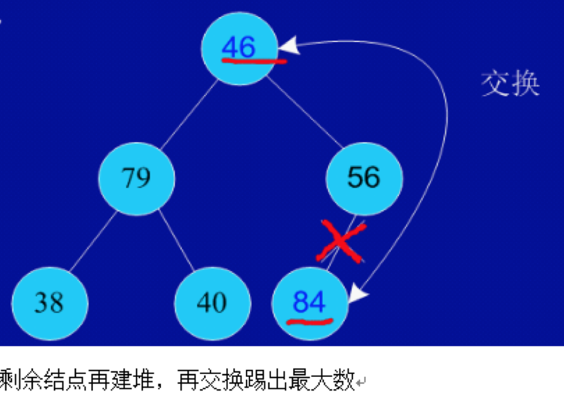

## 快速排序

首先任意选取一个数据（通常选用数组的第一个数）作为关键数据，然后将所有比它小的数都放到它前面，所有比它大的数都放到它后面，这个过程称为一趟快速排序

最好情况：每次划分过程产生的区间大小都为n/2，一共需要划分log2n次，每次需要比较n-1次，O(nlog2n)  
最坏情况：每次划分过程产生的两个区间分别包含n-1个元素和1个元素，一共需要划分n-1次，每次最多交换n-1次，这就是冒泡排序了，O(n2)

## 堆排序

1. 根据初始数组去构造初始堆（构建一个完全二叉树，保证所有的父结点都比它的孩子结点数值大）。
2. 每次交换第一个和最后一个元素，输出最后一个元素（最大值），然后把剩下元素重新调整为大根堆。 
  

堆排序过程的最好和最坏时间复杂度是O(nlog2n)

## TOP K
如何在N个元素中寻找前K大的数？

快速排序：

* 原理：每次快速排序中的划分过程能找到一个全部大于左边元素的一个值。如果该值的位置等于K，那么这个值和它左边的所有元素就是前K大的数；如果该值的位置小于K，那么对右边的元素继续划分排序；如果该值的位置大于K，那么对左边的元素继续划分排序
* 问题：但空间复杂度是O(N)，如果你要在很多元素中找很少几个top K的元素，或者在一个巨大的数据流里找到top K，快速排序是不合适的，堆排序更省地方

堆排序：
* 原理：申请一个容量为K的数组，存入数组的前K个元素，创建长度为K的最小堆；从K开始循环数组的剩余元素，如果元素(a)比最小堆的根节点大，将a设置成最小堆的根节点，然后重建最小堆；循环完成后，最小堆中的所有元素就是需要找的最大的K个元素。
* 优点：可以在N个元素中找到top K，时间复杂度是O(N log K)，空间复杂的是O(K)

欢迎光临[我的博客](http://www.wangtianyi.top/?utm_source=github&utm_medium=github)，发现更多技术资源~
