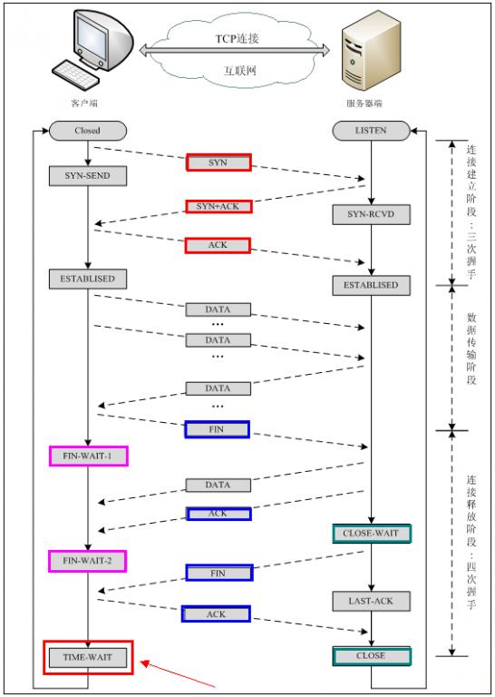

## TCP/IP
OSI是一个理论上的七层网络通信模型，而TCP/IP则是实际运行的四层网络协议。TCP/IP包含：

1. 网络接口层，主机必须使用某种协议与网络相连
2. 网络层，使主机可以把分组发往任何网络，并使分组独立地传向目标。IP协议
3. 传输层，使源端和目的端机器上的对等实体可以进行会话。TCP和UDP协议
4. 应用层，包含所有的高层协议，FTP/TELNET/SMTP/DNS/NNTP/HTTP

## HTTP
HTTP是TCP/IP协议中的【应用层】协议。它不涉及数据包传输，主要规定了客户端和服务器之间的通信格式，是互联网信息交互中最常用的协议

特点：

1. 简单快速。只需要传【请求方法】与【资源路径】就能确定资源
2. 灵活，传输【任意类型】的数据
3. 无连接，一般一次连接只处理一个请求，结束后主动释放连接，但在HTTP1.1中可以使用keep-alive来复用相同的TCP连接发送多个请求
4. 无状态，客户端向服务器发送HTTP请求之后，服务器会给我们发送数据过来，但不会记录任何信息。所以Cookie、Session产生了。

## TCP
TCP是一种面向连接的、可靠的、基于字节流的TCP/IP协议中的【传输层】协议

### 建立连接：三次握手
1. 建立连接时，客户端发送syn包（syn=j）到服务器，并进入SYN_SENT状态，等待服务器确认；SYN：同步序列编号（Synchronize Sequence Numbers）。
2. 服务器收到syn包，必须确认客户的SYN（ack=j+1），同时自己也发送一个SYN包（syn=k），即SYN+ACK包，此时服务器进入SYN_RECV状态；
3. 客户端收到服务器的SYN+ACK包，向服务器发送确认包ACK(ack=k+1），此包发送完毕，客户端和服务器进入ESTABLISHED（TCP连接成功）状态，完成三次握手。

### 为什么要采用三次握手，两次不行吗
避免由于网络延迟导致的创建无效连接的问题。比如客户端发出的一个连接请求没有丢失，而是长时间在某个网络节点滞留了，以至于到连接释放之后才到达服务端，如果不使用三次握手，一旦服务端发出请求连接就会建立连接，但是这个连接请求已经失效了，则会浪费服务端的资源。

### 关闭连接：四次挥手
1. 当主机A的应用程序通知TCP数据已经发送完毕时，TCP向主机B发送一个带有FIN附加标记的报文段（FIN表示英文finish）。
2. 主机B收到这个FIN报文段之后，并不立即用FIN报文段回复主机A，而是先向主机A发送一个确认序号ACK，同时通知自己相应的应用程序：对方要求关闭连接（先发送ACK的目的是为了防止在这段时间内，对方重传FIN报文段）。
3. 主机B的应用程序告诉TCP：我要彻底的关闭连接，TCP向主机A送一个FIN报文段。
4. 主机A收到这个FIN报文段后，向主机B发送一个ACK表示连接彻底释放。

### 为什么连接的时候是三次握手，关闭的时候却是四次握手
因为当Server端收到Client端的SYN连接请求报文后，可以直接发送SYN+ACK报文。其中ACK报文是用来应答的，SYN报文是用来同步的。但是关闭连接时，当Server端收到FIN报文时，很可能并不会立即关闭SOCKET，所以只能先回复一个ACK报文，告诉Client端，"你发的FIN报文我收到了"。只有等到我Server端所有的报文都发送完了，我才能发送FIN报文，因此不能一起发送。故需要四步握手。

### 滑动窗口协议
滑动窗口协议是传输层进行流控的一种措施，接收方通过通告发送方自己的窗口大小，从而控制发送方的发送速度，从而达到防止发送方发送速度过快而导致自己被淹没的目的。

ACK包含两个非常重要的信息：一是期望接收到的下一字节的序号n，该n代表接收方已经接收到了前n-1字节数据。二是当前的窗口大小m，如此发送方在接收到ACK包含的这两个数据后就可以计算出还可以发送多少字节的数据给对方，这就是滑动窗口控制流量的基本原理

TCP的滑动窗口是动态的，应用程序在需要（如内存不足）时，通过API通知TCP协议栈缩小TCP的接收窗口。然后TCP协议栈在下个段发送时包含新的窗口大小通知给对端，对端按通知的窗口来改变发送窗口，以此达到减缓发送速率的目的。

### 与UDP区别
* TCP提供面向连接的、可靠的数据流传输，而UDP提供的是非面向连接的、不可靠的数据流传输，如QQ
* TCP注重数据安全性，UDP数据传输快，因为不需要连接等待，少了许多操作，但是其安全性却一般
* TCP对应的协议（FTP/SMTP/HTTP），UDP（DNS）

## HTTPS
HTTPS协议是由SSL+HTTP协议构建的可进行加密传输、身份认证的网络协议，要比http协议安全，可防止数据在传输过程中被窃取、改变，确保数据的完整性，它大幅增加了中间人攻击的成本。

加密过程：

1. Hello - 握手开始于客户端发送Hello消息。包含服务端为了通过SSL连接到客户端的所有信息，包括客户端支持的各种密码套件和最大SSL版本。服务器也返回一个Hello消息，包含客户端需要的类似信息，包括到底使用哪一个加密算法和SSL版本。
2. 证书交换 - 现在连接建立起来了，服务器必须通过SSL证书证明他的身份。SSL证书包含各种数据，包含所有者名称，相关属性（域名），证书上的公钥，数字签名和关于证书有效期的信息。客户端检查它是不是被CA验证过的且根据数字签名验证内容是否被修改过。注意服务器被允许需求一个证书去证明客户端的身份，但是这个只发生在敏感应用。
3. 密钥交换 - 使用RSA非对称公钥加密算法（客户端生成一个对称密钥，然后用SSL证书里带的服务器公钥将该对称密钥加密。随后发送到服务端，服务端用服务器私钥解密，到此，握手阶段完成。）或者DH交换算法在客户端与服务端双方确定将要使用的密钥。这个密钥是双方都同意的一个简单，对称的密钥。这个过程是基于非对称加密方式和服务器的公钥/私钥的。
4. 加密通信 - 在服务器和客户端加密实际信息是用到对称加密算法，用哪个算法在Hello阶段已经确定。对称加密算法是对于加密和解密都很简单的密钥。这个密钥是基于第三步在客户端与服务端已经商议好的。与需要公钥/私钥的非对称加密算法相反。

## socket线程安全？
总结来说，虽然系统级别的socket操作本身具备一定程度的并发安全性，但在多线程程序中对socket进行读写时仍需要开发者采取适当的同步策略以保证线程安全。

1. 系统调用级别：在操作系统层面，对同一个socket文件描述符（fd）进行读写操作的系统调用如send、recv、write和read等，通常是线程安全的。这意味着多个线程可以同时调用这些函数而不会导致内核数据结构的混乱。
2. 应用程序级别：然而，在应用程序中直接对同一个socket进行并发读写时，并非完全线程安全。不同的线程如果不加控制地同时对同一socket进行读写，可能会遇到以下问题：
   - 数据包边界混淆：TCP是流式传输协议，没有消息边界的概念，两个线程如果并发发送或接收，可能导致接收到的数据边界与发送时不一致。
   - 竞争条件：当多个线程尝试修改socket的状态或缓冲区时，可能会产生未定义的行为，例如，一个线程正在发送数据时，另一个线程关闭了socket，这可能导致不可预测的结果。
   - 同步问题：如果没有适当的锁或其他同步机制来保护共享状态，那么不同线程之间对于何时开始和结束I/O操作的协调就可能出现问题。
3. 最佳实践：为了在多线程环境下正确且安全地使用socket，通常建议采取以下措施：
   - 互斥访问：使用线程同步机制，如互斥锁（mutex），确保任何时候只有一个线程在执行读写操作。
   - 生产者-消费者模型：设计成一个线程专门负责接收数据并放入队列，另一个线程从队列取出数据并发送，通过队列实现线程间的通信和同步。
   - 事件驱动编程：在某些场合下，如使用异步I/O（如epoll/kqueue等）、IOCP（Windows平台）或者事件循环机制，可以避免直接的并发访问，从而在单个线程内处理多个socket连接，减少线程间同步开销。
  
## java socket跟socket有什么区别
1. 抽象层次：
   - 一般意义上的Socket：通常指的是计算机网络编程中的一个抽象概念，是操作系统提供的一种用于进程间通信的机制，通过它可以在网络中不同主机上的进程之间进行双向的数据传输。它是TCP/IP协议栈的一部分，在TCP或UDP等传输层协议之上提供接口。
   - Java Socket：在Java编程语言中，java.net.Socket和java.net.ServerSocket类是对底层操作系统Socket接口的封装，提供了面向对象的方式来创建、管理和使用网络连接。程序员可以通过Java Socket API实现跨网络的客户端-服务器通信。
2. API形式：
   - 通用Socket：在不同的编程语言或环境中，对Socket的操作可能需要直接调用系统API函数（如C语言中的socket()、bind()、listen()、accept()、send()、recv()等）。
   - Java Socket：Java为开发者提供了一套高级且易于使用的API，如Socket socket = new Socket(host, port)来建立到指定主机和端口的连接，以及socket.getInputStream()和socket.getOutputStream()来获取输入输出流以读写数据。
3. 平台无关性：
   - 通用Socket：直接操作系统提供的Socket API时，代码往往具有一定的平台相关性，即在不同的操作系统上可能需要采用不同的API及调用方式。
   - Java Socket：由于Java语言的跨平台特性，其封装的Socket API能够在支持Java的所有平台上运行，使得基于Java Socket编写的网络程序具有良好的可移植性。

综上所述，Java Socket是在Java编程环境下对通用Socket概念的具体实现和抽象，为开发者提供了一个更加便捷、安全且平台无关的方式来处理网络通信问题。
